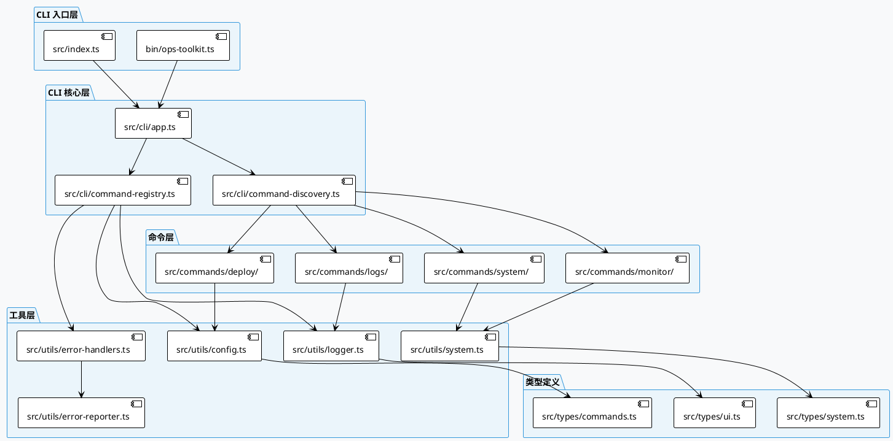
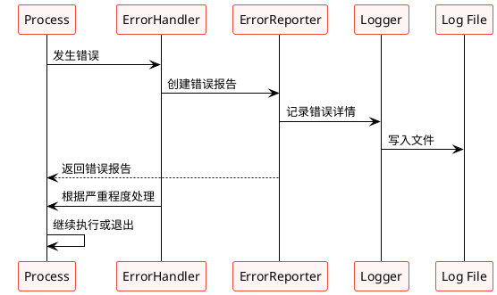
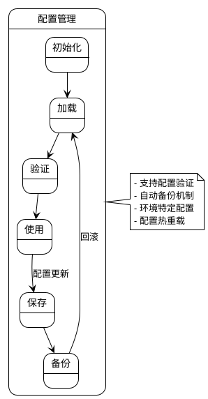
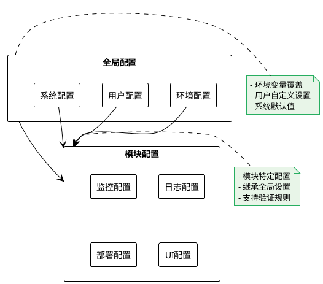
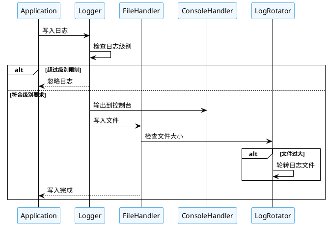
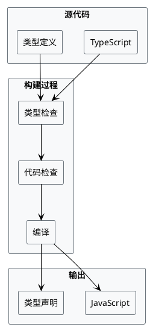

# Ops Toolkit 架构文档

## 概述

Ops Toolkit 是一个现代化的 DevOps CLI 工具包，采用模块化架构设计，提供系统监控、日志管理、部署工具等功能。

## 系统架构

### 整体架构图



### 核心组件

#### CLI 应用程序 (CLIApp)

CLI应用程序是整个系统的核心，负责：

- 初始化配置和错误处理
- 注册和管理命令
- 提供统一的启动入口

#### 命令注册系统 (CommandRegistry)

提供灵活的命令注册机制：

- 支持命令和子命令注册
- 统一的选项处理
- 命令验证和管理

#### 命令发现器 (CommandDiscovery)

自动发现和加载命令：

- 扫描命令目录
- 支持多种导出格式
- 热加载命令模块

## 数据流架构

### 命令执行流程

```plantuml
@startuml
!theme plain
skinparam participant {
    BackgroundColor #E8F4FD
    BorderColor #3498DB
}

participant User
participant CLI as "CLI App"
participant Registry as "CommandRegistry"
 Discovery as "CommandDiscovery"
 Command as "Command"
 Logger as "Logger"
 ErrorHandler as "ErrorHandler"

User -> CLI: 执行命令
CLI -> Registry: 查找命令
Registry -> Discovery: 发现命令
Discovery -> Command: 加载命令模块
Command --> Discovery: 返回命令定义
Discovery --> Registry: 注册命令
Registry --> CLI: 返回命令实例
CLI -> Command: 执行命令
Command -> Logger: 记录日志
Command -> ErrorHandler: 处理错误
CLI -> User: 返回结果

@enduml
```

### 错误处理流程



## 配置系统

### 配置管理架构



### 配置层次结构



## 日志系统

### 日志级别和流向



## 开发指南

### 添加新命令

1. **创建命令目录**

```bash
mkdir src/commands/my-command
```

2. **实现命令类**

```typescript
export const MyCommand: CommandDefinition = {
  name: 'my-command',
  description: '我的自定义命令',
  action: async options => {
    // 命令逻辑
  },
};
```

3. **自动发现**
   命令发现器会自动扫描并注册新命令。

### 扩展配置

```typescript
// 注册配置验证器
ConfigManager.registerValidator('myValidator', {
  validate: config => {
    /* 验证逻辑 */
  },
  getErrors: () => {
    /* 返回错误信息 */
  },
});
```

### 错误处理

```typescript
try {
  // 业务逻辑
} catch (error) {
  errorHandler(
    error,
    {
      command: 'my-command',
      action: 'execute',
    },
    ErrorSeverity.HIGH
  );
}
```

## 部署和构建

### 构建流程



### 质量保证

- **类型检查**：`bun run typecheck`
- **代码规范**：`bun run lint`
- **自动修复**：`bun run lint:fix`
- **格式化**：`bun run format`

## 性能优化

### 内存管理

- 日志缓冲区限制（1000条）
- 配置缓存机制
- 命令延迟加载

### 异步处理

- 所有I/O操作使用异步模式
- 错误处理不阻塞主流程
- 并发命令执行支持

## 安全考虑

- 配置文件权限控制
- 敏感信息不记录日志
- 输入验证和清理
- 错误信息脱敏

## 扩展性

### 插件系统

系统支持通过命令发现机制扩展插件：

```typescript
// 插件示例
export class MyPlugin {
  static commands = [MyCommand1, MyCommand2];
  static config = {
    /* 插件配置 */
  };
}
```

### API接口

统一的命令接口确保兼容性和可测试性。

## 总结

Ops Toolkit 采用现代化的架构设计，具备以下特点：

- **模块化**：清晰的层次结构
- **可扩展**：灵活的插件机制
- **健壮性**：完善的错误处理
- **可维护**：类型安全和文档完善
- **高性能**：异步和优化机制

这个架构为未来的功能扩展和性能优化提供了坚实的基础。
